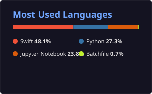

# Hi there, I'm Pasquale Coppola 👋
### Data Scientist & Machine Learning Specialist from Naples, Italy 🇮🇹

---

## 🎓 About Me

- 🎓 Graduated with a Master's Degree in **Data Science & Machine Learning**
- 🔭 Currently working on data-driven projects, machine learning models, and software development
- 💻 Explore all my public projects and code repositories on my [GitHub Profile](https://github.com/pasq96?tab=repositories)
- ⚡ **Fun Fact:** When I'm not training models or coding, I love tinkering with Linux systems and network configurations!

---

## 🛠️ Languages & Technologies

### **Data Science & Machine Learning**

  
  
  

### **Software Development & Web**

  
  
  
  
  
  

### **Databases, Mobile & Systems**

  
  
  
  

---

## 📊 GitHub Stats

  
  

